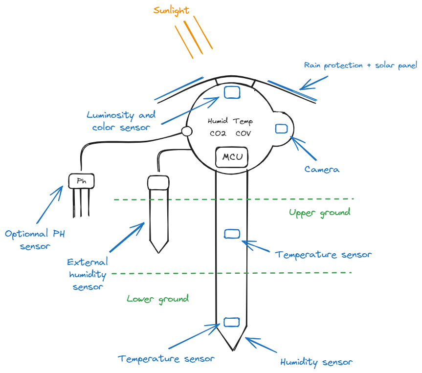

# Cahier des Charges - Projet IoT Smart Farming

## 1. Introduction

### 1.1 Contexte

L’agriculture sous serre permet un meilleur contrôle des conditions climatiques et des ressources. L’objectif de ce projet est d’optimiser la gestion des paramètres environnementaux d’une serre grâce à un système IoT intelligent. Composé de capteurs autonomes, ce système permettra à l'utilisateur de suivre l'état de ses plantations à distance via interface web.  

### 1.2 Objectifs

- Surveiller en temps réel les paramètres clés (température, humidité, luminosité, etc.)  
- Fournir une interface utilisateur pour la visualisation et le contrôle à distance  
- Optimiser la consommation d’énergie et d’eau  

### 1.3 Périmètre

Ce projet concerne uniquement une serre de 15 mètres de diamètre à Saint-Cyr l'école, équipée de capteurs connectés.  

## 2. Description du Besoin

### 2.1 Fonctionnalités attendues

- 📡 **Acquisition de données** : capteurs de température, humidité, CO₂, luminosité et d'image, en option le ph et les paramètres NPK
- 📲 **Communication** : transmission des données via LoRaWAN, Wi-Fi ou 5G
- 📊 **Interface utilisateur** : application web / mobile pour supervision et alertes  

## 3. Contraintes

### 3.1 Techniques

- Microcontrôleur : **F1 de SG Wireless**  
- Communication : **LoRa / Wi-Fi / 5G / BLE**  
- Alimentation : **Batterie + panneaux solaires**  
- Logiciel : **Firmware embarqué + Backend cloud + Application web/mobile**

### 3.2 Réglementaires

- Respect des normes environnementales et électriques  
- Conformité aux réglementations IoT (GDPR, LPD, LoRaWAN OTAA, etc.)  

### 3.3 Budget

# TODO

- Coût matériel estimé : **[montant] €**
- Développement logiciel : **[montant] €**

## 4. Architecture du Système

### 4.1 Schéma général

Voici le schéma d'un module :

### 4.2 Composants  

Pour chaque module :

| Type                | Composant                       | Quantité      |
| ------------------- | ------------------------------- | ------------- |  
| Microcontrôleur     | F1 de SG Wireless               | 1             |  
| Capteur Temp/Hum    | DF Robot inground soil humidity | 2             |  
| Capteur CO₂         | SCD 40                          | 1             |
| Appareil Photo      | Module camera OV5640            | 1             |  
| Communication       | Module Lora / 5G intégré au MCU | 1             |  

Ce qui fait pour 36 un total de `6 (nb de modules produit) * 6` composants.

## 5. Interfaces Utilisateur

### 5.1 Dashboard

- Graphiques temps réel  
- Alertes et notifications  

### 5.2 API et Cloud

- API REST pour l’accès aux données  
- Stockage des mesures et historique dans une base de données

## 6. Caractérisation des fonction

Tableau des fonctions :

| Fonctions de service              | Critères d'appréciation                            | Niveau d'appréciation   | Flexibilité   |
| --------------------------------- | -------------------------------------------------- | ----------------------- | ------------- |
| Acquisition des données capteurs  | Précision des mesures, taux de collecte, fiabilité | Élevé                   | Moyenne       |
| Transmission des données          | Taux de réussite, couverture, latence              | Élevé                   | Faible        |
| Traitement et analyse             | Rapidité, exactitude, sécurité                     | Moyen                   | Élevée        |
| Interface Dashboard               | Clarté, ergonomie, temps de réponse                | Élevé                   | Moyenne       |

## 7. Conclusion

Ce projet vise à démontrer comment l’IoT peut améliorer la gestion des serres agricoles en automatisant la collecte de données et le contrôle des paramètres environnementaux.
