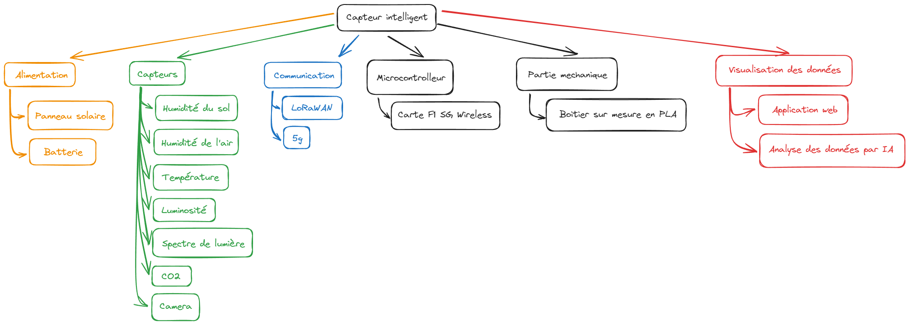
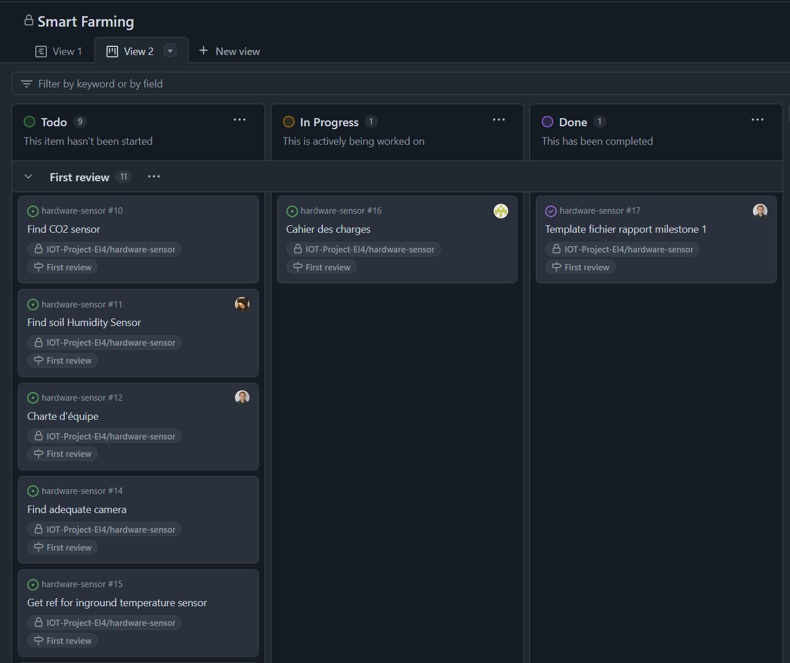
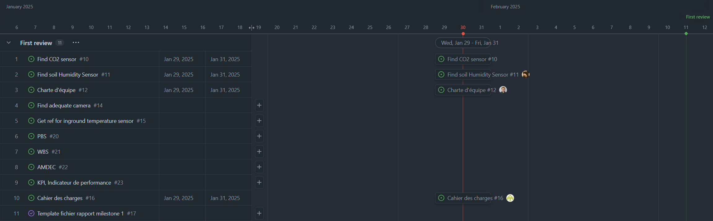

# Milestone 1

**Due date :** le 11/02/2025

### Todo:

- [x] Structure de découpage du projet, PBS : Product Breakdown Structure
- [ ] L’organigramme des tâches, WBS : Work Breakdown Structure
- [ ] Gestion des risques, AMDEC
- [ ] Indicateur de performance
- [x] Gestion des tâches et du code, Gantt et Kanban (tableau de bord)
- [x] Communication
- [ ] Plannification
- [ ] Charte d'équipe
- [x] Fiches d'auto évaluation
- [x] Tests de perception
- [ ] Schéma fonctionnel et description des fonctionnalités
- [ ] Cahier des charges
- [ ] Liste du matériel nécessaire
- [ ] Budget prévisionnel

## Structure de découpage du projet, PBS : Product Breakdown Structure

Schema de la structure de découpage du projet : [management/pbs.excalidraw](management/pbs.excalidraw)

## L’organigramme des tâches, WBS : Work Breakdown Structure

**TODO**

## Gestions des risques, AMDEC

**TODO**

## Gestion des tâches et du code, Gantt et Kanban (tableau de bord)

Nous avons décider d'utilisr les outils intégrés dans GitHub pour gérer notre projet. Nous avons donc utilisé les issues pour lister les tâches à réaliser, les milestones pour définir les étapes du projet et les projets pour organiser les tâches.

Tous ces éléments sont accessibles depuis le tableau de bord du projet dans lequel plusieurs vues sont disponibles tel que le tableau kanban, le tableau de bord des issues et pull requests et le Gantt.

Vue Kanban : [https://github.com/orgs/IOT-Project-EI4/projects/3/views/2](https://github.com/orgs/IOT-Project-EI4/projects/3/views/2)

Vue Gantt : [https://github.com/orgs/IOT-Project-EI4/projects/3/views/1](https://github.com/orgs/IOT-Project-EI4/projects/3/views/1)

## Communication

Pour la communication, nous avons mis en place un groupe WhatsApp pour les échanges rapides par messages et nous utiliserons aussi les outils de GitHub pour l'assignation des nouvelles tâches.

## Plannification

**TODO**

## Charte d'équipe

**TODO :** insérer un lien vers la charte d'équipe

## Fiches d'auto évaluation

[Valentin Le Lievre](management/fiches%20auto%20evaluation/valentin%20le%20lievre.pdf), [Jana Dagher](management/fiches%20auto%20evaluation/jana%20dagher.pdf), [Inessa Kechek](management/fiches%20auto%20evaluation/inessa%20kechek.pdf), [Joakim Lagarde](management/fiches%20auto%20evaluation/joakim%20lagarde.pdf)

## Tests de perception

[Valentin Le Lievre](management/tests%20de%20perception/valentin%20le%20lievre.xlsx), [Jana Dagher](management/tests%20de%20perception/jana%20dagher.xlsx), [Inessa Kechek](management/tests%20de%20perception/inessa%20kechek.xlsx), [Joakim Lagarde](management/tests%20de%20perception/joakim%20lagarde.xlsx)

## Schéma fonctionnel et description des fonctionnalités

Description des fonctionnalitées : [../../ideas/draft.excalidraw](../../ideas/draft.excalidraw)

Schéma fonctionnel : [../../ideas/module.excalidraw](../../ideas/module.excalidraw)

## Cahier des charges

Le cahier des charges est disponible ici : [Cahier des charges](cahier%20des%20charges.md)

## Liste du matériel nécessaire

**TODO :** insérer un lien vers la liste du matériel nécessaire

## Budget prévisionnel

### Matériel

### Humain

**TODO**

## Bibliographie

Liens vers les ressources utilisées : [../../links.md](../../links.md)
