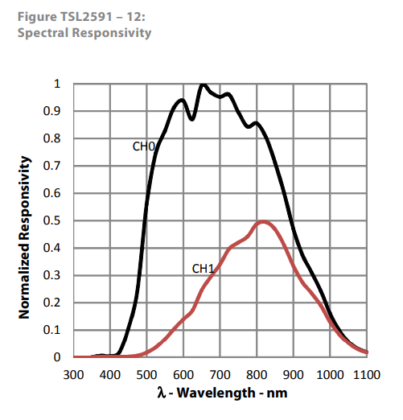

# Datasheet - TSL2591

## Lien vers la datasheet
[TSL2591 Datasheet](https://cdn-shop.adafruit.com/datasheets/TSL25911_Datasheet_EN_v1.pdf)

---

## Tableau : Conditions météorologiques et éclairement lumineux

| **Conditions météorologiques**     | **Éclairement lumineux (lux)** |
|------------------------------------|-------------------------------|
| Nuit sans lune                     | 0,01 - 0,2 lx               |
| Nuit avec pleine lune              | 0,1 - 0,3 lx                   |
| Aube ou crépuscule                 | 10 - 500 lx                      |
| Ciel très couvert (jour sombre)    | 1000 - 5000 lx                   |
| Ciel nuageux léger                 | 5000 - 20 000 lx                  |
| Journée ensoleillée à l’ombre      | 10 000 - 20 000 lx                 |
| Soleil direct (sans nuage)         | 50 000 - 100 000 lx               |

---

## Spectral Responsivity

La qualité des mesures effectuées dépend en partie de la longueur d'onde de la lumière perçue. Les longueur d'ondes allant vers les ultra violets et les infrarouges sont facilement détectées :

[](https://cdn-shop.adafruit.com/datasheets/TSL25911_Datasheet_EN_v1.pdf)

---

# Explication des calculs pour la conversion en lux

Le code suivant montre comment convertir les valeurs brutes lues des canaux du capteur TSL2591 en lux :

```c
float atime = 100.0F;
float again = 25.0F;
float cpl = (atime * again) / TSL2591_LUX_DF;
float lux1 = (ch0 - (TSL2591_LUX_COEFB * ch1)) / cpl;
float lux2 = ((TSL2591_LUX_COEFC * ch0) - (TSL2591_LUX_COEFD * ch1)) / cpl;
return lux1 > lux2 ? lux1 : lux2;
```

---

## Explication des variables et calculs

### `atime` : Temps d’intégration de l’ADC

- Fixé à **100 ms**.

### `again` : Gain analogique

- Fixé à **25**.

### `cpl` : Coefficient de conversion en lux

- Formule :  
  $$
  cpl = \frac{atime \times again}{TSL2591\_LUX\_DF}
  $$
- Constante : `TSL2591_LUX_DF = 408.0F`

Exemple de calcul :
\[
cpl = \frac{100.0 \times 25.0}{408.0} \approx 6.127
\]

---

### Calcul de lux1 (Première estimation)

- Formule :  
  $$
  lux1 = \frac{ch0 - (TSL2591\_LUX\_COEFB \times ch1)}{cpl}
  $$
- Constante : `TSL2591_LUX_COEFB = 1.64F`

---

### Calcul de lux2 (Deuxième estimation)

- Formule :  
  \[
  lux2 = \frac{(TSL2591\_LUX\_COEFC \times ch0) - (TSL2591\_LUX\_COEFD \times ch1)}{cpl}
  \]
- Constantes :
- `TSL2591_LUX_COEFC = 0.59F`
- `TSL2591_LUX_COEFD = 0.86F`

---

## Retour de la valeur finale de lux

La fonction retourne la plus grande valeur entre `lux1` et `lux2`.

---

## Exemple complet de calcul

Supposons les valeurs brutes suivantes :

- `ch0 = 30000`
- `ch1 = 5000`

### Étape 1 : Calcul de `cpl`

$$
cpl = \frac{100.0 \times 25.0}{408.0} \approx 6.127
$$

### Étape 2 : Calcul de `lux1`

$$
lux1 = \frac{30000 - (1.64 \times 5000)}{6.127}
$$
$$
lux1 = \frac{30000 - 8200}{6.127} = \frac{21800}{6.127} \approx 3557.5
$$

### Étape 3 : Calcul de `lux2`

$$
lux2 = \frac{(0.59 \times 30000) - (0.86 \times 5000)}{6.127}
$$
$$
lux2 = \frac{17700 - 4300}{6.127} = \frac{13400}{6.127} \approx 2187.5
$$

### Résultat final

Puisque `lux1` (3557.5) est supérieur à `lux2` (2187.5), la fonction retourne :
$$
\mathbf{lux = 3557.5 \text{ lux}}
$$
